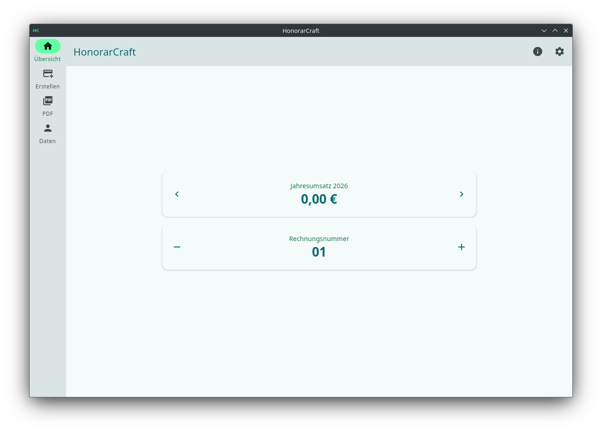
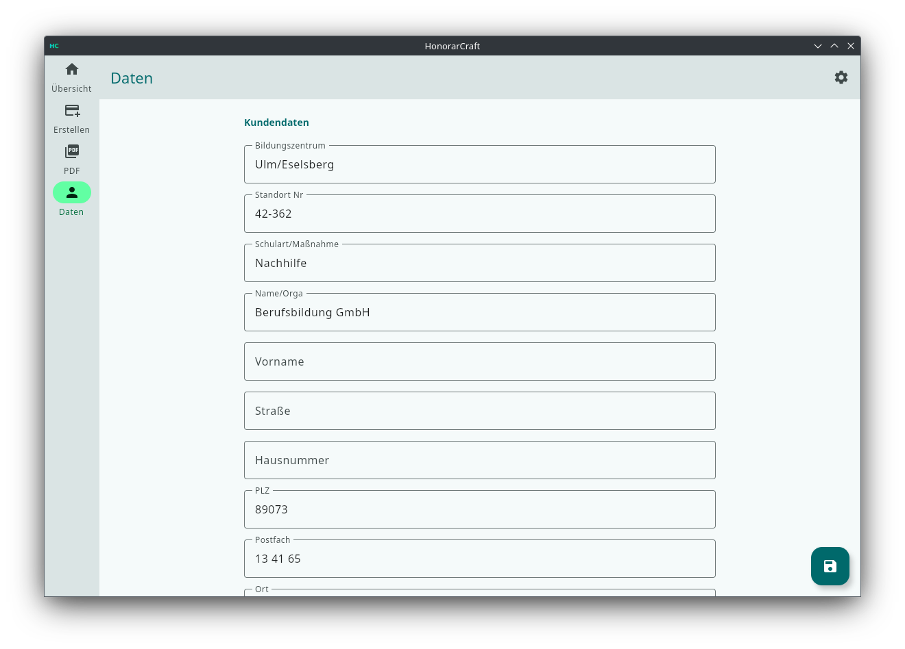
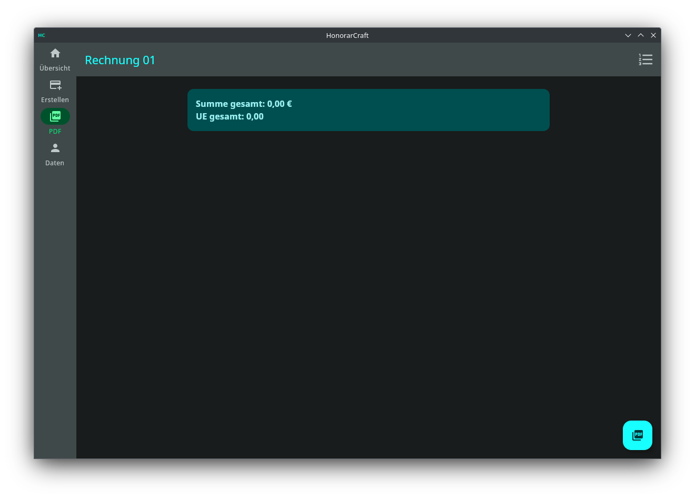
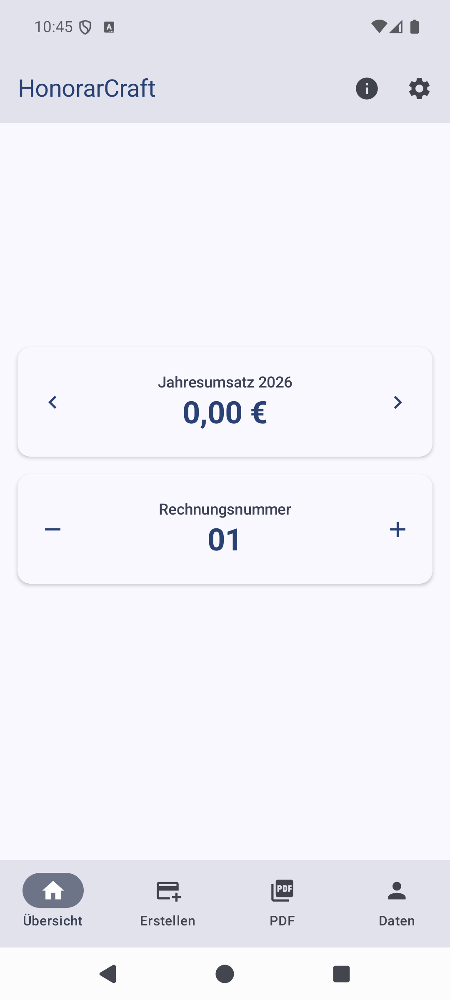
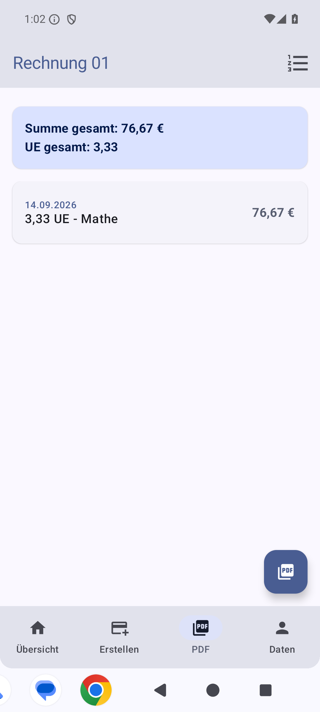
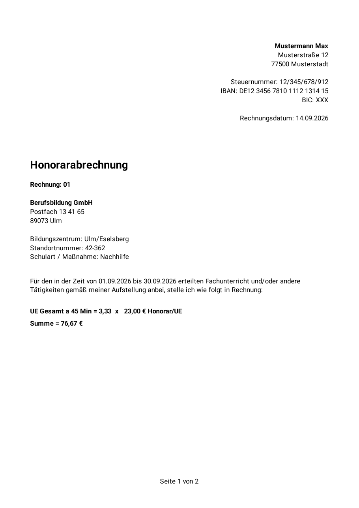

# HonorarCraft v2.0

Ein modernes Tool zur Honorarabrechnung und Rechnungsverwaltung für **Desktop und Android**,
entwickelt mit **Compose Multiplatform** und **Kotlin**. Beide Plattformen teilen sich
Datenhaltung, Rechenlogik, Oberfläche und das PDF-Layout; Sicherungen lassen sich zwischen
Handy und Rechner austauschen.

## ✨ Funktionen

* **Ein Programm, zwei Plattformen:** Linux, Windows, macOS und Android – aus derselben
  Codebasis. Oberfläche, Rechenlogik und das erzeugte PDF sind auf allen Geräten dieselben.
* **Präzise Abrechnung:** Keine Rundungsfehler. Gerechnet wird durchgängig mit `BigDecimal`;
  gerundet wird einmal am Ende und nicht je Position, damit die Summe stimmt.
* **Intelligente Erfassung:** Schnelle Eingabe von Stunden, Datum und Fächern, mit
  Vorschlägen aus den zuletzt gebuchten Fächern.
* **PDF-Export:** Erstellt die Rechnung mit einem Klick, auf beiden Plattformen identisch.
  Der Zielordner ist frei wählbar.
* **Rechnungs-Management:** Die Rechnungsnummer wird nach dem erfolgreichen Export erhöht;
  wahlweise als laufende Nummer, mit Jahr oder mit Jahr und Monat.
* **Sicherung und Umzug:** Der komplette Datenbestand lässt sich in eine Datei schreiben und
  wieder einlesen – **auch plattformübergreifend.** Eine Sicherung vom Handy öffnet sich auf
  dem Rechner und umgekehrt; ältere Sicherungen werden dabei automatisch auf den aktuellen
  Stand gehoben.
* **Heller und dunkler Modus,** wahlweise der Systemeinstellung folgend.
* **Lokale Datenhaltung:** Alle Daten bleiben auf dem Gerät. Es gibt keine Netzwerk-
  berechtigung und keinen Server.

> **Hinweis zum Datenschutz:** Die Daten liegen unverschlüsselt in einer lokalen
> SQLite-Datenbank. Auf Android schützt sie die App-Isolation des Betriebssystems, und das
> automatische Google-Backup ist abgeschaltet (`allowBackup="false"`), damit Steuernummer und
> IBAN nicht in der Cloud landen. Auf dem Desktop liegt die Datenbank im Benutzerverzeichnis
> und ist für jeden lesbar, der Zugriff auf das Konto hat. Wer mehr braucht, sollte das
> Betriebssystem verschlüsseln.
> *(Bis Version 1.2.1 verschlüsselte die Desktop-Fassung einzelne Felder mit AES. Das ist mit
> 2.0 entfallen: der Schlüssel lag daneben in den Java-Preferences, was gegen niemanden
> geschützt hat, der ohnehin Zugriff auf das Konto hatte.)*

## 🛠 Technische Details

* **Sprache:** [Kotlin](https://kotlinlang.org/) (Kotlin Multiplatform)
* **UI-Framework:** [Compose Multiplatform](https://www.jetbrains.com/lp/compose-multiplatform/)
* **Datenhaltung:** [Room](https://developer.android.com/training/data-storage/room) mit
  gebündeltem SQLite, dieselbe Datenbank und dieselbe Migrationskette auf beiden Plattformen
* **Build-System:** Gradle (Kotlin DSL)
* **Zielplattformen:** Desktop (JVM) und Android (ab Android 10)

### Aufbau

| Modul | Inhalt |
|---|---|
| `shared` | Modelle, Datenbank, Migrationen, Rechenlogik, ViewModel, PDF-Layout |
| `composeApp` | Die Oberfläche – vier Bereiche, gemeinsam für beide Plattformen |
| `androidApp` | Nur `MainActivity` und Manifest |

Über 90 % des Codes liegt im gemeinsamen Teil. Plattformabhängig sind nur Datei-Dialoge,
Bildladen und die beiden PDF-Renderer (PDFBox auf dem Desktop, `PdfDocument` auf Android),
die beide dasselbe Layout-Modell abzeichnen.

#### 📦 Installation & Download

**Desktop:** Vorkompilierte Installationspakete stehen unter **Releases** bereit:

* **`.msi`**: Für Windows (getestet auf Windows 10/11).
* **`.dmg`**: Für macOS (ungetestet).
* **`.deb`**: Für Linux-Systeme (getestet auf Mint/Ubuntu).

**Android:** Über den Google Play Store.

## 📸 Screenshots

### Desktop

| Übersicht | Firmendaten |
|---|---|
|  |  |

Ab etwa 900 dp Fensterbreite steht die Navigation als Seitenleiste, darunter wechselt die
Oberfläche auf dieselbe Ansicht wie auf dem Handy.

#### Dunkelmodus

### Android

  
  

Auf Android schlägt die dynamische Farbgebung von Material 3 durch — die App übernimmt dort
die Systemfarben.

### 📄 Erzeugte Rechnung

Dasselbe Layout auf beiden Plattformen, hier aus der Android-Fassung:

*Alle Aufnahmen zeigen Beispieldaten.*
